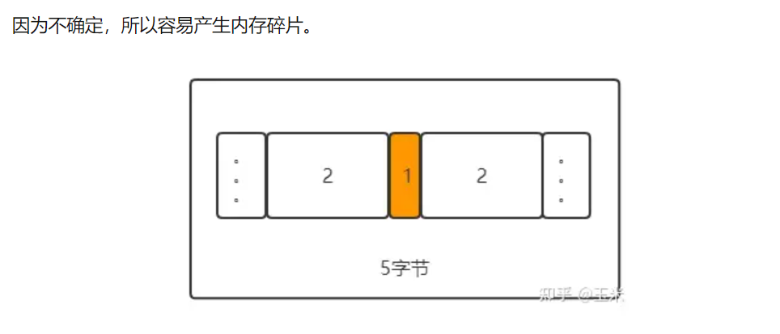

如果频繁地malloc和free，由于malloc的地址是不确定的，
因为每次malloc的时候，会先在freelist中找一个适合其大小
的块，如果找不到，才会调用sbrk直接拓展堆的内存边界。
（`freelist是之前free掉的内存`，内核会将其组织成一个链表，留待下次malloc的时候查找使用。）

>黄色为已分配内存
> 
> 如果我们需要4个字节的空间，却因为malloc的位置随机分配在这个滑稽的位置，就导致虽然我们有2+2的空间但是只能望洋兴叹的尴尬处境。

内存池在不同的框架中，实现不尽相同。

为什么会有区别，根本原因是面向的实际业务不同，从而导致不同公司的内存池会灵活变通，有各自鲜明的特点。在Nginx的服务器中，每当有一个客户端connect进来后，就会为其单独创建一个内存池，用于recv和send的缓冲区buffer。

所以Nginx的内存池的特点是，其包含了两种内存分配方式，大内存和小内存使用不同的数据结构来存储。从而适应客户端不同的请求，如果只是一些简单的表单，就用小内存，如果是上传下载大文件，就用大内存。

同时Nginx的内存池还有一个重要的特点：不像线程池会回收利用所有线程，Nginx的内存池不回收小内存的buffer，只回收大内存的buffer。

同样是出于实际业务的考虑，每个内存池都对应一个客户，那么一个客户端产生的小内存碎片自然不会太多，即使不回收，也不会有太大代价。`同时tcp本身就有keep-alive机制`，超过一定时间就断开，Nginx是典型的将不同客户端分发到多进程的网络模型，`连接断开，进程结束，从而对应的内存池会释放，相当于一次性回收所有的大小内存。`但是在连接中大内存因为占用空间大，Nginx觉得还是有必要回收，所以只做了回收大内存这个接口。
